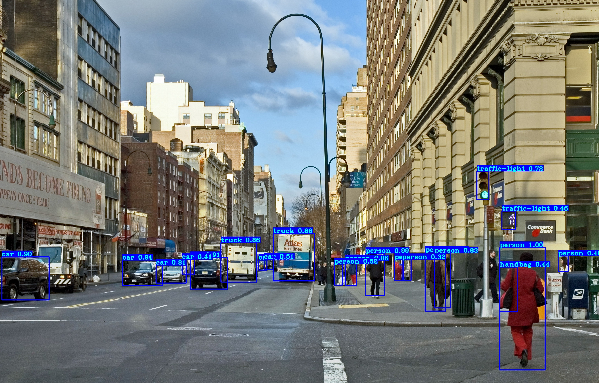
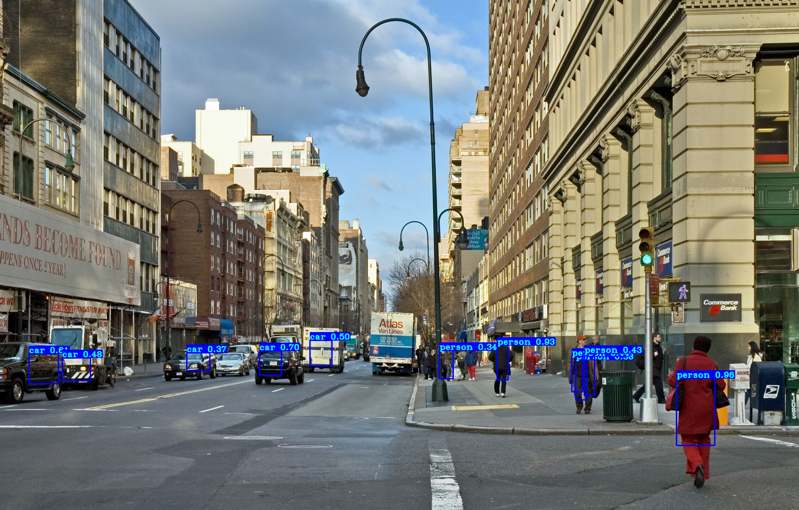

# Object Detection with YOLOv3

## Objective

YOLOv3 is one of the most popular real-time object detectors. 
Here is YOLOv3 model built with tensorflow 2.x for object detection with official weights pre-trained on COCO dataset.

## Dependencies & Environment
* Ubuntu 16.04
* Python 3.6
* OpenCV 4.4.0
* Tensorflow-gpu 2.3.0

See more requirements in [environment.yml](environment.yml). 

## Prepare

Install **tensorflow-gpu** to use gpu for calculation.
```sh
pip install tensorflow-gpu
```

## Quick start

1. Download the official weights pretrained on COCO dataset and copy it to folder /model_data:
    ```sh
    wget -P weights https://pjreddie.com/media/files/yolov3.weights
    ```  
   
2. Set configurations for YOLOv3 in [configs.py](./yolov3/configs.py)

3. Build YOLOv3 model with *create_yolo* in [yolov3.py](./yolov3/yolov3.py).
   
4. Convert downloaded weights to TensorFlow format with *load_yolo_weights* in [utils.py](./yolov3/utils.py).

5. Run [detection_main.py](./detection_main.py) to test the model for object detection:
    ```sh
    python main.py
    ```

* Result with YOLOv3


* Result with YOLOv3-tiny


## Conclusion

* The accuracy of YOLOv3 for object detection is very good!
* The speed of YOLOv3 is really fast, with a gpu Nvidia Titan X it can go up to 30 fps. 
* With YOLOv3-tiny the speed can be even faster but with less accuracy.
